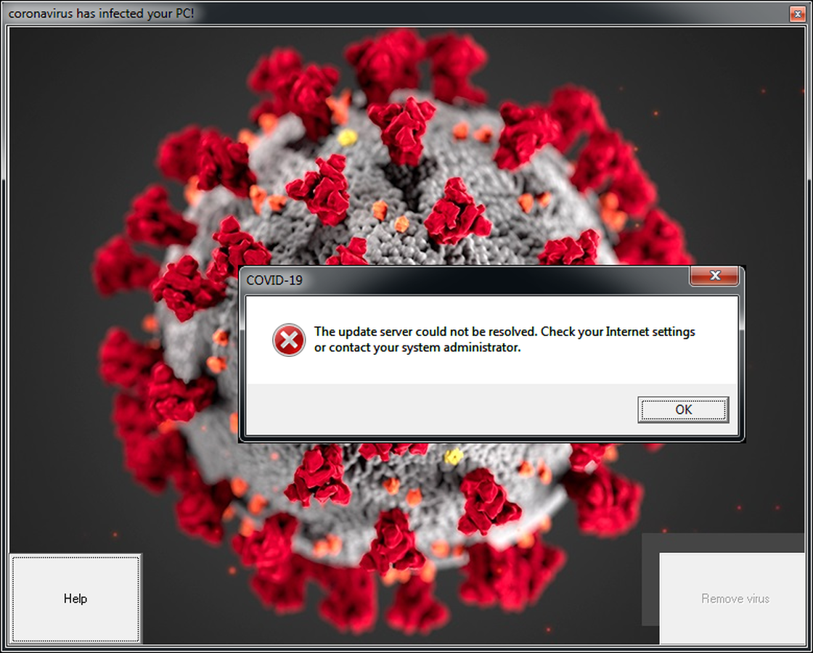
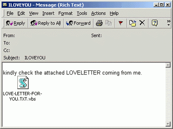
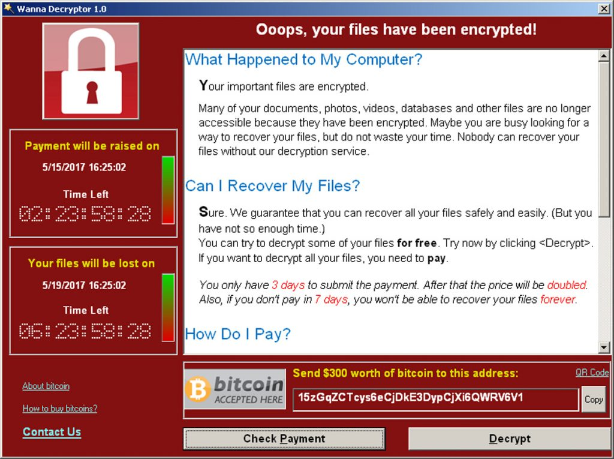

[[Back]](../README.md)

# Malware
There is no doubt that you are aware of what viruses are if you've ever used a computer before. Likely you are aware of how dangerous they are to your computer, and they may be the first thing you blame once your computer starts to move slower than usual. Their creators probably living in a dark lair somewhere plotting how to extort innocent people. But there is a lot more depth to creating viruses than you likely are aware of, and the many different forms of viruses there are out there. Or the fact that viruses themselves fall under the larger branch of malicious software known as Malware, and the sheer variety of malware there is out there.

## What is Malware really
    Malware has been known to take many forms, some used for spying, others for ads, and some purely for the fun of it. However, what most malware carries in some form or other is a payload. The payload is what is used to do the dirty work, such as removing files or disabling an antivirus. Perhaps commands to gather certain information on the user, or focus on spreading more of the malware across the network, or even await orders from a third party across the internet. The payload is the code holding the task that the malware has been created to do. 

## How do they do it?
There are two keys ways for a piece of malware to infect your computer.
1. ### Tricking you
    You must take some sort of action for the malware to be downloaded or executed on your device. For example, you may view a webpage with malicious code, or insert a USB drive, or open some shady email attachment. Malware is infamous for social engineering and tricking people into downloading it. In a more recent example, a malware going by the very original name, COVID-19 Malware, involves a file called 'covid19.exe' which curious users may download, only to have their computer's master boot record altered and their device rendered un-startable.
    

1. ### Software flaws
    Secondly, by exploiting some sort of flaw in existing software. This is something which you will have to worry less about, as long as you are keeping up with your updates, it is not something you can do much about. Sometimes software just has flaws, and people find ways to break in. As long as you're not using outdated or unreliable software, you should be safe from this for the most part, or at least as safe as you can be.

## Different Types and what do they do
1. ### Viruses
    * A piece of malware that latches onto existing harmless programs/files, making them not so harmless. When the file is run, the malware runs as well and begins to spread to other files. Adding its code to the files and modifying the files so that control is passed to the virus instead.
1. ### Worms
    * A self-spreading malware with no user involvement may spread via email, private networks, or public internet access
    
    

1. ### Trojans
    * Malware built into a program, fooling users into thinking its harmless, until they download it. 
1. ### Logic Bomb
    * Waits until a certain condition is met and then it delivers the infection
1. ### Adware
    * Gathers information on users' and uses the information to display targeted ads to users
1. ### Spyware
    * A silent malware that gathers information on a user and delivers it to the malicious party
1. ### Rootkit
    * Malware that runs with high-level privileges on the computer, using privileges to hide from the system.
1. ### Dropper
    * The task of this malware is to install some other malware on the system. This malware is not necessary very deadly, but the malware it installs may be.
1. ### Downloader
    * A Dropper that downloads its malware from the internet
1. ### Ransomware
    * Malware that demands a ransom from users in exchange for them regaining access to their devices
1. ### Keylogger
    * A silent malware that records keystrokes on a device and sends the information off to a third party
1. ### Scareware
    * Malware that uses fear and intimidation to get users to pay ransoms, or purchase software

## How do I protect myself?
Many people choose to invest in fancy antivirus software and pay a monthly fee to keep their computer protected, with famous and effective antivirus software, like BitDefender, Malwarebytes. Whilst it is no doubt a good thing to have solid antivirus software, you can be fairly safe by just being 'internet smart'. Meaning:
* Don't visit shady websites
* Don't make risky downloads
* Don't open those scam emails, **especially the attachments**
* If you have a windows system, keep up to date on windows-defender updates 
* Keep your [firewall](./firewalls.md) up